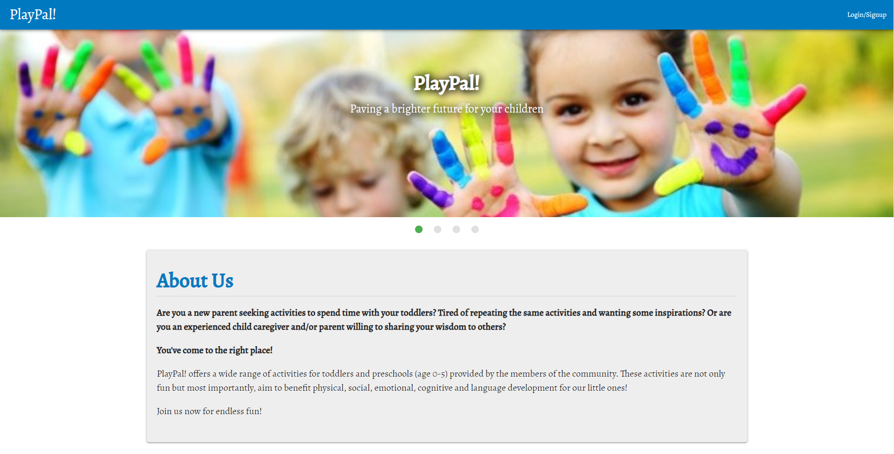

# PlayPal!
## Description

PlayPal! is a MERN stack app that to helps parents to plan their day with their toddlers and preschoolers with a wide range of activities. These activities are not just for fun but most importantly, aim to benefit physical, social, emotional, cognitive and language skills development for our little ones. All members are able to contribute their ideas.

[](https://opensource.org/licenses/MIT)


## Installation

```
npm install
```

## Usage

Click [here](https://playpal2020.herokuapp.com/) to launch the application

### How To Use
1. Click on "Login/Signup" on the navbar to sign up for an account or log in if already has an account
2. Click on "Search" for the Search page or "Create" to create an activity
3. On the Search page, simply choose a category and results will be automatically filtered
4. On the Create page, fill out the forms to create an activity!

### Screenshots


## License

License for this project: MIT

## Contributing

1. Fork/Clone this repo
2. Hack away!
3. Create a new pull request
4. Good commits will be accepted


## Questions

If you have any questions/doubts, feel free to contact me via:
* GitHub: [https://github.com/ZanHong](https://github.com/ZanHong)
* Email: [mokzanhong92@hotmail.com](mailto:mokzanhong92@hotmail.com)
